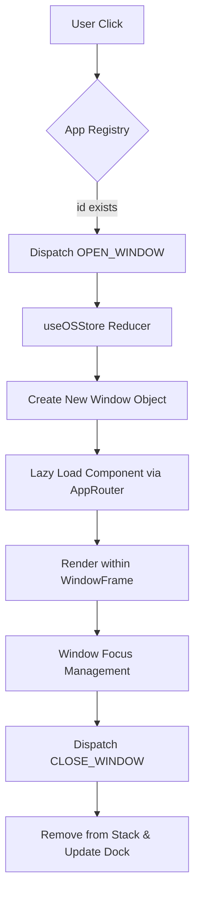
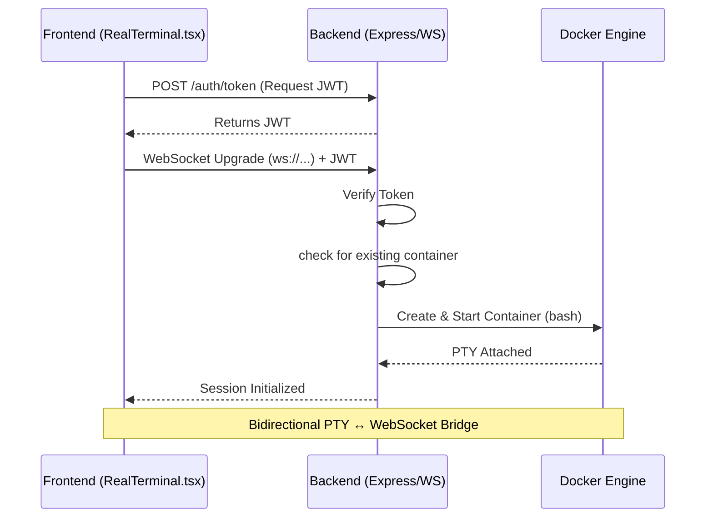
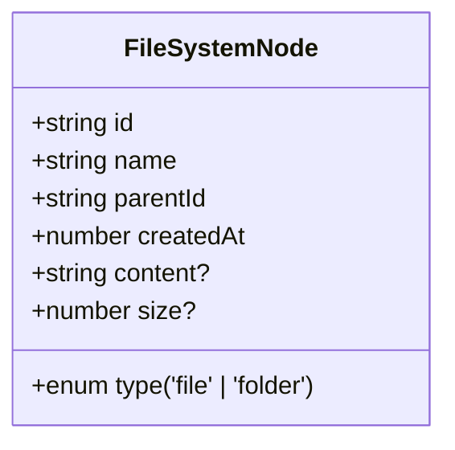

# Project Architecture Document (PAD)

This document serves as the single source-of-truth for the technical architecture of **UbuntuOS Web**. It is designed to initialize new developers and AI agents, providing a source-grounded map of the system's design and implementation patterns.

---

## 1. System Overview

**UbuntuOS Web** is a high-fidelity, interactive web-based replica of the Ubuntu Linux desktop environment. It operates as a Single-Page Application (SPA) that virtualizes an operating system's core behaviors: window management, a hierarchical file system, and an application ecosystem.

### High-Level Architecture
- **Frontend**: React 19 SPA. Manages UI, windowing, and virtualized state.
- **Backend (Hybrid)**: Node.js server. Exclusively handles "Real Terminal" sessions using Docker and `node-pty`.
- **Persistence**: Browser `localStorage` with runtime Zod schema validation.

---

## 2. File Hierarchy

```text
/home/project/web-linux/
├── app/                        # Frontend Application (React/Vite)
│   ├── src/
│   │   ├── apps/               # 55 Pre-installed Applications
│   │   │   ├── registry.ts     # Central application metadata & categories
│   │   │   ├── AppRouter.tsx   # Dynamic routing & lazy-loading engine
│   │   │   └── ...             # Individual app components (e.g., Terminal.tsx)
│   │   ├── components/         # Core UI Components
│   │   │   ├── WindowFrame.tsx # Standardized window chrome (drag/resize)
│   │   │   ├── Dock.tsx        # System taskbar
│   │   │   └── ...
│   │   ├── hooks/              # Core Logic (Custom Hooks)
│   │   │   ├── useOSStore.tsx  # Central State Engine (Reducers/Context)
│   │   │   ├── useFileSystem.ts# Virtual File System logic
│   │   │   └── ...
│   │   ├── utils/              # Utility Functions
│   │   │   ├── safeEval.ts     # Hardened math parser (eval prohibition)
│   │   │   ├── sanitizeHtml.ts # DOMPurify wrappers
│   │   │   ├── storageValidation.ts # Zod schema validation for persistence
│   │   │   └── vfsHelpers.ts   # DRY traversal helpers (recursive move/delete)
│   │   └── types/              # Unified TypeScript definitions
│   └── vite.config.ts          # Build & Proxy configuration
├── backend/                    # Terminal Backend (Node.js/Express)
│   ├── src/
│   │   ├── docker.ts           # Hardened container lifecycle management
│   │   ├── websocket.ts        # PTY ↔ WebSocket bridge
│   │   ├── auth.ts             # JWT issuance for terminal sessions
│   │   └── index.ts            # Entry point
│   └── package.json
└── GEMINI.md                   # Agent-specific contextual instructions
```

---

## 3. Core Architectural Pillars

### A. OS State Engine (`useOSStore.tsx`)
The "brain" of the OS. Uses `useReducer` and React Context to manage a global state object.
- **Window Management**: Windows are stored in a stack. Focus is handled by incrementing a global `nextZIndex` (capped at `2147483647`).
- **Persistence**: Desktop icon positions are debounced and synced to `localStorage`.

### B. Virtual File System (`useFileSystem.ts`)
A robust, ID-based node management system.
- **Node-Centric**: Files and folders are referenced by unique IDs, preventing breakage when paths change.
- **Traversal Helpers**: `vfsHelpers.ts` provides `walkAndDelete` and `recurseMoveNode` to handle recursive operations immutably.
- **MIME Associations**: Maps file extensions to specific `appId`s (e.g., `.md` -> `markdownpreview`).

### C. Real Terminal (Hybrid Integration)
Bridges the browser to a real Linux kernel.
1. **Frontend**: `RealTerminal.tsx` uses `xterm.js` to render PTY output.
2. **Bridge**: WebSocket connection with JWT-based authentication.
3. **Backend**: Spawns a hardened Docker container (`--read-only`, `--network=none`) and attaches `node-pty` to the bash process.

---

## 4. Application Flowcharts (Mermaid)

### Window Lifecycle Flow


### Real Terminal Session Initialization


---

## 5. Data Modeling & Persistence

### Storage Schema (Zod)
The system persists data under two primary keys in `localStorage`.

| Key | Schema Type | Description |
| :--- | :--- | :--- |
| `ubuntuos_desktop_icons` | `z.array(DesktopIconSchema)` | Icon positions, labels, and app/VFS links. |
| `ubuntuos_filesystem_v2` | `FileSystemStateSchema` | Node Map (ID -> Node) and Trash Metadata. |

### VFS Node Schema


---

## 6. Security Architecture

### Evaluator Policy
- **Mandatory**: `eval()` and `new Function()` are **forbidden**.
- **Alternative**: All math (Terminal `calc`, Spreadsheet formulas) must use `safeEval.ts` (Shunting-Yard algorithm).

### Injection Mitigation
- **XSS**: `dangerouslySetInnerHTML` must be wrapped in `sanitizeHtml()` (DOMPurify).
- **CSS**: Dynamic colors must be validated via `isValidColor()` from `colorValidation.ts`.
- **ReDoS**: Any user-controlled regex must use `countMatchesSafely()` with an iteration cap (1000).

---

## 7. Developer Handbook

### Local Setup
1. **Frontend**: `cd app && npm install && npm run dev`
2. **Backend**: `cd backend && npm install && npm run dev` (Requires Docker)

### Pull Request Standards
- **Strict TypeScript**: `noUnusedLocals` and `noUnusedParameters` must pass.
- **TDD Requirement**: Logic changes require corresponding `vitest` unit tests.
- **Build Hygiene**: Run `npx tsc -b --noEmit` and `npx vitest run` before submitting.
- **Lazy Loading**: New apps must be added to `APP_REGISTRY` and `AppRouter.tsx` using `lazy()`.
