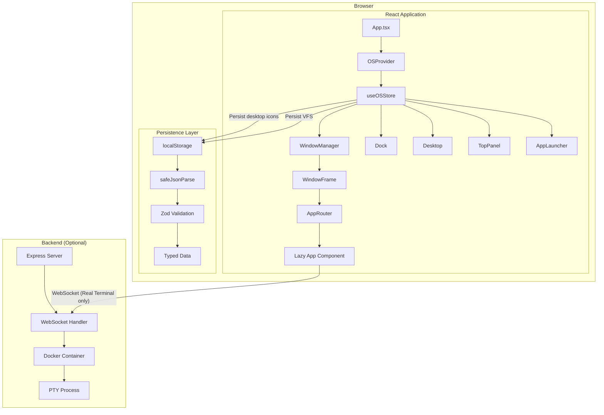
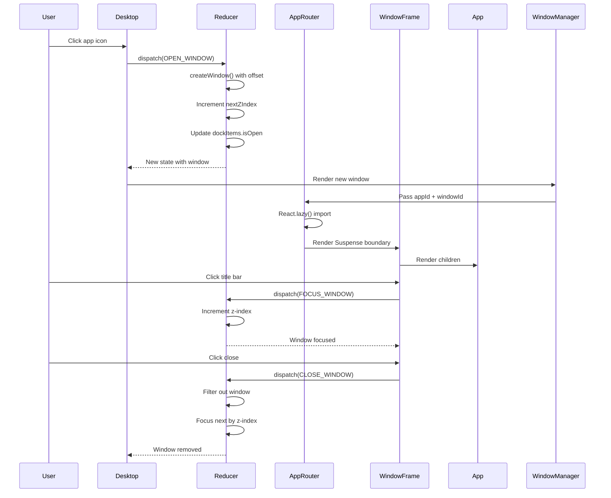
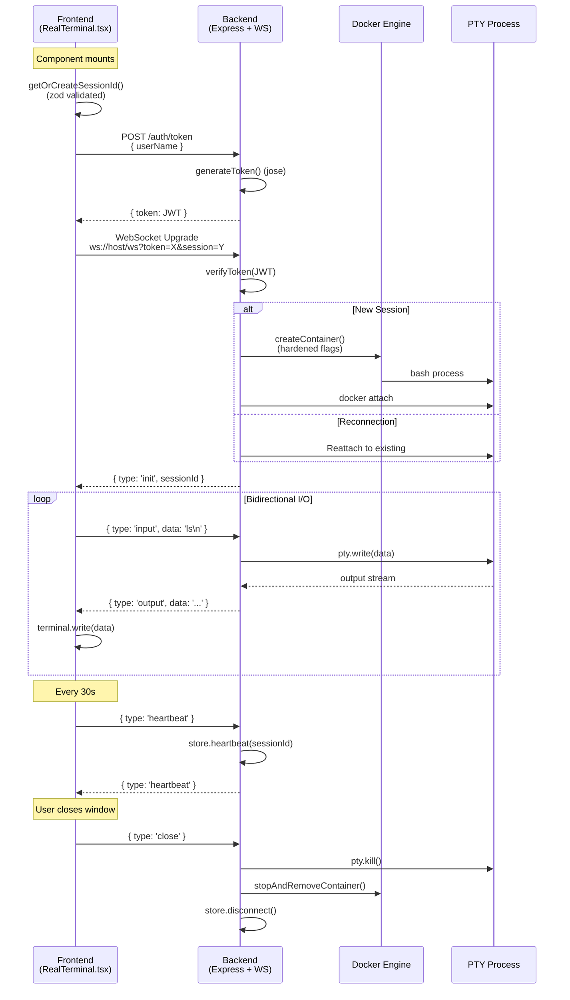
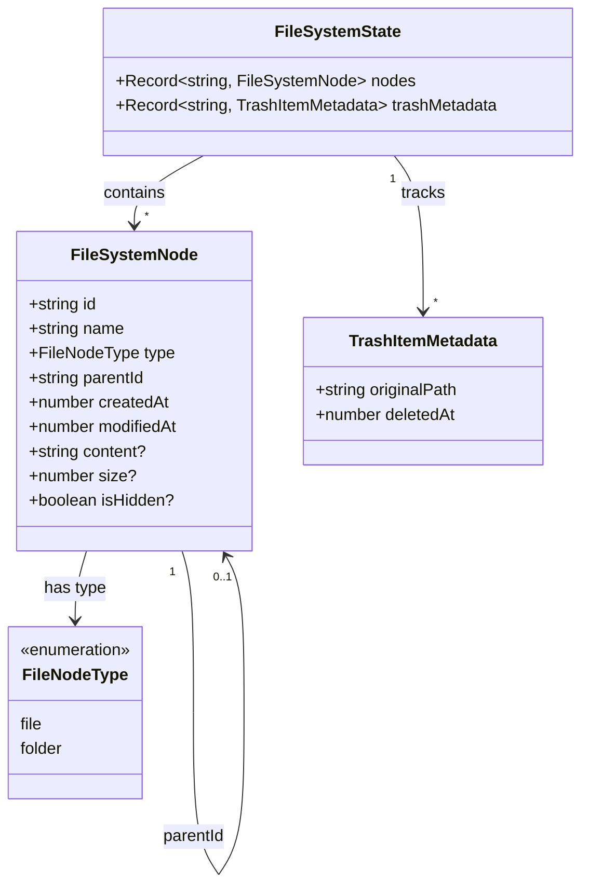
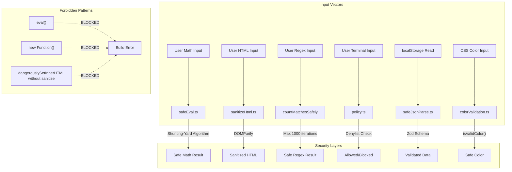
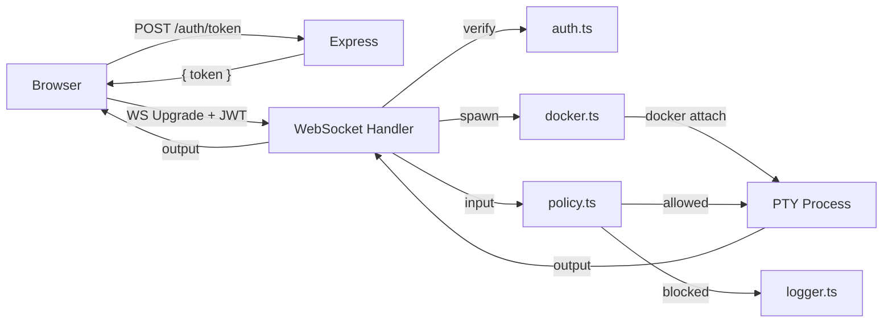

# Project Architecture Document (PAD)

> **Single Source-of-Truth** for UbuntuOS Web  
> Version: 2.0 | Last Updated: 2026-06-06  
> Purpose: Initialize new developers and AI agents to handle PRs independently

---

## Table of Contents

1. [System Overview](#1-system-overview)
2. [Complete File Hierarchy](#2-complete-file-hierarchy)
3. [Core Architecture](#3-core-architecture)
4. [Data Flow Diagrams](#4-data-flow-diagrams)
5. [Data Models & Persistence](#5-data-models--persistence)
6. [Security Architecture](#6-security-architecture)
7. [Backend Architecture](#7-backend-architecture)
8. [Developer Handbook](#8-developer-handbook)
9. [Testing Strategy](#9-testing-strategy)
10. [Build & Deployment](#10-build--deployment)

---

## 1. System Overview

**UbuntuOS Web** is a high-fidelity, interactive web-based replica of the Ubuntu Linux desktop environment. It operates as a Single-Page Application (SPA) that virtualizes an operating system's core behaviors: window management, a hierarchical file system, and an application ecosystem.

### Architecture Summary

| Layer | Technology | Purpose |
|-------|------------|---------|
| **Frontend** | React 19.2 + TypeScript 5.9 | Component-based UI, state management, virtualized OS |
| **Build** | Vite 7.2 | Development server, code splitting, production builds |
| **Styling** | Tailwind CSS 3.4 + Radix UI | Utility-first styling, accessible primitives |
| **Backend** | Node.js + Express + WebSocket | Real Terminal sessions via Docker + PTY |
| **Persistence** | localStorage + Zod validation | Browser-side data persistence with runtime validation |
| **Security** | DOMPurify + safeEval + policy engine | XSS prevention, safe math evaluation, command filtering |

### Key Metrics

| Metric | Value |
|--------|-------|
| Total Applications | 56 |
| Frontend Test Files | 22 |
| Backend Test Files | 9 |
| Total Tests | 185 |
| Backend Modules | 9 (index, config, auth, docker, websocket, sessionStore, policy, logger, types) |

---

## 2. Complete File Hierarchy

```text
/home/project/web-linux/
│
├── 📄 README.md                          # Project overview, quick start, features
├── 📄 CLAUDE.md                          # AI agent coding standards & conventions
├── 📄 AGENTS.md                          # Codebase audit analyst role definition
├── 📄 Project_Architecture_Document.md   # This document (single source-of-truth)
│
├── 📁 app/                               # ═══════════════════════════════════════
│   │                                     # Frontend Application (React/Vite)
│   ├── 📄 package.json                   # Dependencies & scripts
│   ├── 📄 tsconfig.app.json              # TypeScript config (strict, erasableSyntaxOnly)
│   ├── 📄 vite.config.ts                 # Vite config with /ws proxy
│   ├── 📄 tailwind.config.mjs            # Tailwind configuration
│   ├── 📄 index.html                     # Entry HTML
│   │
│   └── 📁 src/
│       ├── 📄 App.tsx                    # Root component
│       ├── 📄 main.tsx                   # Entry point
│       │
│       ├── 📁 apps/                      # ═══ 56 Application Components ═══
│       │   ├── 📄 registry.ts            # Central app metadata & categories
│       │   ├── 📄 AppRouter.tsx          # Dynamic lazy-loading router
│       │   │
│       │   ├── 📁 __tests__/             # App-level tests
│       │   │   ├── 📄 registry-completeness.test.ts
│       │   │   ├── 📄 VoiceRecorder.test.tsx
│       │   │   └── 📄 NotImplemented.test.tsx
│       │   │
│       │   └── 📄 [56 App Files].tsx     # Individual app components
│       │       ├── Terminal.tsx           # Simulated bash terminal
│       │       ├── RealTerminal.tsx       # Real PTY terminal (Docker)
│       │       ├── FileManager.tsx        # VFS file browser
│       │       ├── Calculator.tsx         # Scientific calculator
│       │       ├── TextEditor.tsx         # Text editor with tabs
│       │       ├── Settings.tsx           # System preferences
│       │       ├── ScreenRecorder.tsx     # Real screen capture
│       │       ├── VoiceRecorder.tsx      # Audio recording
│       │       └── ... (48 more)
│       │
│       ├── 📁 components/                # ═══ Core UI Components ═══
│       │   ├── 📄 WindowFrame.tsx        # Window chrome (drag/resize/controls)
│       │   ├── 📄 WindowManager.tsx      # Window container orchestrator
│       │   ├── 📄 Dock.tsx               # System taskbar
│       │   ├── 📄 Desktop.tsx            # Desktop icons & wallpaper
│       │   ├── 📄 TopPanel.tsx           # Top menu bar
│       │   ├── 📄 AppLauncher.tsx        # Application grid launcher
│       │   ├── 📄 LoginScreen.tsx        # Authentication screen
│       │   ├── 📄 BootSequence.tsx       # Boot animation
│       │   ├── 📄 ContextMenu.tsx        # Right-click menus
│       │   ├── 📄 NotificationCenter.tsx # Notification panel
│       │   ├── 📄 NotificationSystem.tsx # Toast notifications
│       │   ├── 📄 DynamicIcon.tsx        # Runtime Lucide icon resolver
│       │   ├── 📄 NotImplemented.tsx     # Fallback for unbuilt apps
│       │   ├── 📄 GlobalErrorBoundary.tsx # React error boundary
│       │   │
│       │   ├── 📁 __tests__/             # Component tests
│       │   │   ├── 📄 aria-attributes.test.ts
│       │   │   ├── 📄 ContextMenu-actions.test.tsx
│       │   │   └── 📄 NotImplemented.test.tsx
│       │   │
│       │   └── 📁 ui/                    # Radix UI primitives (52 files)
│       │       ├── button.tsx, dialog.tsx, input.tsx, ...
│       │       └── (Shadcn UI components)
│       │
│       ├── 📁 hooks/                     # ═══ Core Logic Hooks ═══
│       │   ├── 📄 useOSStore.tsx         # OS state engine (Context + Reducer)
│       │   ├── 📄 useFileSystem.ts       # Virtual File System logic
│       │   ├── 📄 useAuthToken.tsx       # JWT token management
│       │   ├── 📄 use-mobile.ts          # Mobile detection
│       │   │
│       │   └── 📁 __tests__/             # Hook tests
│       │       ├── 📄 osReducer.test.ts
│       │       ├── 📄 osReducer-zindex.test.tsx
│       │       ├── 📄 osReducer-auth-source.test.ts
│       │       └── 📄 osReducer-minimizeAll.test.ts
│       │
│       ├── 📁 utils/                     # ═══ Utility Functions ═══
│       │   ├── 📄 safeEval.ts            # Hardened math parser (eval forbidden)
│       │   ├── 📄 sanitizeHtml.ts        # DOMPurify XSS wrappers
│       │   ├── 📄 safeJsonParse.ts       # JSON.parse + zod validation
│       │   ├── 📄 storageValidation.ts   # localStorage schema validation
│       │   ├── 📄 vfsHelpers.ts          # VFS traversal (walkAndDelete, recurseMoveNode)
│       │   ├── 📄 colorValidation.ts     # CSS color validation
│       │   ├── 📄 pinStorage.ts          # PasswordManager PIN storage
│       │   ├── 📄 authToken.ts           # Dev-only JWT generation
│       │   ├── 📄 backendUrl.ts          # Centralized backend URLs
│       │   │
│       │   └── 📁 __tests__/             # Utility tests (9 files)
│       │       ├── safeEval.test.ts
│       │       ├── safeJsonParse.test.ts
│       │       ├── storageValidation.test.ts
│       │       ├── vfsHelpers.test.ts
│       │       ├── colorValidation.test.ts
│       │       ├── pinStorage.test.ts
│       │       ├── gameHighscore.test.ts
│       │       └── ...
│       │
│       └── 📁 types/                     # ═══ TypeScript Definitions ═══
│           └── 📄 index.ts               # All shared types & interfaces
│
├── 📁 backend/                           # ═══════════════════════════════════════
│   │                                     # Terminal Backend (Node.js/Express)
│   ├── 📄 package.json                   # Backend dependencies
│   ├── 📄 tsconfig.json                  # TypeScript config
│   ├── 📄 Dockerfile                     # Hardened terminal container
│   │
│   └── 📁 src/
│       ├── 📄 index.ts                   # Entry point (HTTP + WebSocket server)
│       ├── 📄 config.ts                  # Environment config with zod validation
│       ├── 📄 auth.ts                    # JWT generation/verification (jose)
│       ├── 📄 docker.ts                  # Container lifecycle management
│       ├── 📄 websocket.ts              # PTY ↔ WebSocket bridge
│       ├── 📄 sessionStore.ts           # In-memory session management
│       ├── 📄 policy.ts                 # Command restriction engine
│       ├── 📄 logger.ts                 # Audit logging
│       ├── 📄 types.ts                  # Shared protocol types
│       │
│       └── 📁 __tests__/                # Backend tests (9 files)
│           ├── auth.test.ts
│           ├── config.test.ts
│           ├── docker.test.ts
│           ├── policy.test.ts
│           ├── logger.test.ts
│           ├── types.test.ts
│           ├── sessionStore.test.ts
│           ├── websocket.test.ts
│           └── integration.test.ts
│
└── 📁 .agents/                           # Agent skills and configurations
    └── 📁 skills/
```

---

## 3. Core Architecture

### 3.1 OS State Engine (`useOSStore.tsx`)

The "brain" of the OS. Uses `useReducer` and React Context to manage global state.

**State Shape:**
```typescript
interface OSState {
  bootPhase: BootPhase;          // 'off' | 'logo' | 'loading' | 'desktop' | 'login'
  auth: AuthState;               // { isAuthenticated, isGuest, userName, authToken? }
  windows: Window[];             // Stack of open windows
  apps: AppDefinition[];         // All 56 app definitions
  desktopIcons: DesktopIcon[];   // Desktop icon positions
  theme: Theme;                  // { mode, accent, wallpaper }
  notifications: Notification[];
  dockItems: DockItem[];         // Taskbar state
  contextMenu: ContextMenuState;
  activeWindowId: string | null;
  nextZIndex: number;            // Capped at 2147483647
}
```

**Key Reducer Actions:**
| Action | Purpose |
|--------|---------|
| `OPEN_WINDOW` | Creates window, increments z-index, updates dock |
| `CLOSE_WINDOW` | Removes window, focuses next by z-index |
| `MINIMIZE_WINDOW` | Saves prevPosition/prevSize, hides window |
| `MAXIMIZE_WINDOW` | Saves prevPosition/prevSize, fills screen |
| `RESTORE_WINDOW` | Restores saved position/size |
| `FOCUS_WINDOW` | Increments z-index, sets as active |
| `MINIMIZE_ALL` | Minimizes all windows, saves positions |
| `CASCADE_WINDOWS` | Arranges windows in cascade pattern |

### 3.2 Virtual File System (`useFileSystem.ts`)

ID-based node management system for file/folder operations.

**Architecture:**
- Nodes stored in `Record<string, FileSystemNode>` (flat map)
- Each node has unique `id` and `parentId` (null for root)
- Paths are resolved via traversal, not stored
- Persisted to `localStorage` under `ubuntuos_filesystem_v2`

**Key Operations:**
| Operation | Function | Description |
|-----------|----------|-------------|
| Create | `createFile()`, `createFolder()` | Adds node to record |
| Read | `findNodeByPath()`, `getNodeById()` | Traversal-based lookup |
| Update | `writeFile()`, `renameNode()` | Updates node properties |
| Delete | `deleteNode()` | Uses `walkAndDelete()` helper |
| Move | `moveToTrash()` | Uses `recurseMoveNode()` helper |

### 3.3 Window Management

**Z-Index Stacking:**
- Global `nextZIndex` counter (starts at 100)
- Capped at `2147483647` (CSS max) to prevent overflow
- `FOCUS_WINDOW` increments and assigns
- Focus by clicking window or dock icon

**Window States:**
```
normal → minimized → normal (restore)
normal → maximized → normal (restore)
```

**Window Chrome (`WindowFrame.tsx`):**
- Dragging via `onMouseDown` on title bar
- Resize via resize handles (all 8 directions)
- Controls: minimize, maximize/restore, close
- All apps render inside `WindowFrame` (no custom chrome)

### 3.4 Application Loading

**Lazy Loading Pattern:**
```typescript
const Terminal = lazy(() => import('./Terminal'));
const RealTerminal = lazy(() => import('./RealTerminal'));
// ... 54 more lazy imports
```

**Loading Flow:**
1. User clicks app icon → `OPEN_WINDOW` dispatched
2. `AppRouter` receives `appId` → lazy import triggered
3. `Suspense` shows `AppSkeleton` during load
4. Component renders inside `WindowFrame`

---

## 4. Data Flow Diagrams

### 4.1 Application Architecture Overview



### 4.2 Window Lifecycle Flow



### 4.3 Real Terminal Session Flow



### 4.4 VFS Data Model



### 4.5 Security Architecture



---

## 5. Data Models & Persistence

### 5.1 localStorage Schema

| Key | Zod Schema | Description |
|-----|------------|-------------|
| `ubuntuos_desktop_icons` | `z.array(DesktopIconSchema)` | Icon positions, labels, app/VFS links |
| `ubuntuos_filesystem_v2` | `FileSystemStateSchema` | Node map + trash metadata |
| `ubuntuos_screenrecordings` | `z.array(RecordingSchema)` | Screen recording metadata |
| `real-terminal-session-id` | `z.string().uuid()` | Terminal session persistence |
| `password_manager_pin` | `z.string().regex(/^\d{4}$/)` | Password manager PIN |
| `ubuntuos_passwords` | `z.array(PasswordEntrySchema)` | Encrypted password entries |
| `ubuntuos_contacts` | `z.array(ContactSchema)` | Contact list |
| `ubuntuos_browser_tabs` | `z.array(BrowserTabSchema)` | Browser tab state |

### 5.2 VFS Node Schema

```typescript
interface FileSystemNode {
  id: string;           // Unique identifier (UUID-like)
  name: string;         // Display name
  type: 'file' | 'folder';
  parentId: string | null;  // null = root level
  createdAt: number;    // Unix timestamp
  modifiedAt: number;   // Unix timestamp
  content?: string;     // File content (text only)
  size?: number;        // Byte size (computed via TextEncoder)
  isHidden?: boolean;   // Hidden files
}
```

### 5.3 Window Schema

```typescript
interface Window {
  id: string;           // Generated ID
  appId: string;        // Registry ID
  title: string;        // Display title
  position: Position;   // { x, y } from top-left
  size: Size;           // { width, height }
  state: 'normal' | 'minimized' | 'maximized';
  prevPosition?: Position;  // Saved for restore
  prevSize?: Size;          // Saved for restore
  isFocused: boolean;
  zIndex: number;       // Stacking order
  icon: string;         // Lucide icon name
  createdAt: number;
}
```

### 5.4 Desktop Icon Schema

```typescript
interface DesktopIcon {
  id: string;
  name: string;
  icon: string;         // Lucide icon name
  appId?: string;       // Opens this app
  fileSystemNodeId?: string;  // Or opens this VFS node
  position: Position;
  isSelected: boolean;
}
```

---

## 6. Security Architecture

### 6.1 Mandatory Rules

| Rule | Implementation | Enforced By |
|------|----------------|-------------|
| **No `eval()`** | `safeEval.ts` (Shunting-Yard) | Build error, code review |
| **No `new Function()`** | Same as above | Build error, code review |
| **No raw `dangerouslySetInnerHTML`** | `sanitizeHtml()` wrapper | Code review, ESLint |
| **Validate localStorage** | `safeJsonParse()` + Zod | Code review, tests |
| **Named Lucide imports** | Only `DynamicIcon.tsx` uses wildcard | ESLint, build |
| **ReDoS protection** | `countMatchesSafely()` with 1000 cap | Tests |
| **Unbounded array cap** | Factorial capped at 170 | Tests |

### 6.2 Security Utilities

| Utility | Location | Purpose |
|---------|----------|---------|
| `safeEval()` | `utils/safeEval.ts` | Math evaluation without eval |
| `sanitizeHtml()` | `utils/sanitizeHtml.ts` | XSS prevention via DOMPurify |
| `sanitizeMarkdownHtml()` | `utils/sanitizeHtml.ts` | Markdown-specific sanitization |
| `safeJsonParse()` | `utils/safeJsonParse.ts` | JSON + Zod validation |
| `validateDesktopIcons()` | `utils/storageValidation.ts` | Desktop icon persistence |
| `validateFileSystem()` | `utils/storageValidation.ts` | VFS persistence |
| `isValidColor()` | `utils/colorValidation.ts` | CSS color validation |
| `countMatchesSafely()` | `apps/TextEditor.tsx` | ReDoS prevention |

### 6.3 Backend Security

| Control | Implementation |
|---------|----------------|
| JWT Authentication | `jose` library, HS256 signing |
| Command Filtering | `policy.ts` denylist (18 patterns) |
| Audit Logging | `logger.ts` records all commands |
| Container Hardening | `--read-only`, `--cap-drop=ALL`, `--network=none` |
| Non-root User | Container runs as `uid=1000` |
| Resource Limits | 1 CPU, 512MB RAM, 100 PIDs |

---

## 7. Backend Architecture

### 7.1 Module Overview

```
backend/src/
├── index.ts          # Entry: Express HTTP + WebSocket upgrade
├── config.ts         # Zod-validated environment config
├── auth.ts           # JWT generation/verification (jose)
├── docker.ts         # Container lifecycle (dockerode + node-pty)
├── websocket.ts      # PTY ↔ WebSocket bridge + policy enforcement
├── sessionStore.ts   # In-memory session Map with TTL
├── policy.ts         # Command denylist engine
├── logger.ts         # Audit logger (in-memory, JSON)
└── types.ts          # Shared protocol types
```

### 7.2 Request Flow



### 7.3 Session Lifecycle

| State | Description | Transition |
|-------|-------------|------------|
| `active` | Connected and receiving I/O | → `disconnected` (on WS close) |
| `disconnected` | Grace period (default 5 min) | → `active` (reconnect) or cleanup |
| `closed` | Terminated | Removed from store |

---

## 8. Developer Handbook

### 8.1 Local Setup

**Frontend Only:**
```bash
cd app
npm install
npm run dev        # Starts on http://localhost:3000
```

**With Backend (Real Terminal):**
```bash
# Terminal 1 - Backend
cd backend
npm install
npm run docker:build   # Build custom container image
npm run dev            # Starts on http://localhost:3001

# Terminal 2 - Frontend
cd app
npm install
npm run dev            # Proxies /ws to backend
```

### 8.2 Common Commands

| Command | Location | Purpose |
|---------|----------|---------|
| `npm run dev` | `app/` | Start Vite dev server |
| `npm run build` | `app/` | TypeScript check + production build |
| `npm test` | `app/` | Run frontend test suite |
| `npm run lint` | `app/` | ESLint check |
| `npx tsc -b --noEmit` | `app/` | Type-check without emitting |
| `npm run dev` | `backend/` | Start backend with hot reload |
| `npm test` | `backend/` | Run backend test suite |
| `npm run docker:build` | `backend/` | Build terminal container |

### 8.3 Adding a New App

**Step 1:** Create component at `app/src/apps/YourApp.tsx`
```tsx
export default function YourApp() {
  return <div>Your app content</div>;
}
```

**Step 2:** Register in `app/src/apps/registry.ts`
```typescript
{
  id: 'yourapp',
  name: 'Your App',
  icon: 'YourIcon',  // Lucide icon name
  category: 'System',  // PascalCase!
  description: 'Description here',
  defaultSize: { width: 640, height: 480 },
  minSize: { width: 320, height: 240 },
}
```

**Step 3:** Add to `app/src/apps/AppRouter.tsx`
```typescript
const YourApp = lazy(() => import('./YourApp'));
// In switch:
case 'yourapp': return <YourApp />;
```

**Step 4:** Add tests and verify
```bash
npm test
npx tsc -b --noEmit
```

### 8.4 Code Style Rules

| Rule | Enforcement |
|------|-------------|
| TypeScript strict mode | `tsconfig.app.json` |
| No `any` types | TypeScript compiler |
| No unused imports/variables | `noUnusedLocals: true` |
| Named Lucide imports | ESLint (wildcard only in `DynamicIcon.tsx`) |
| PascalCase categories | `AppCategory` type |
| Zod for localStorage | Code review |
| TDD for security code | Best practice |

### 8.5 Git Workflow

1. Create feature branch from `main`
2. Implement with tests
3. Run `npm test` and `npx tsc -b --noEmit`
4. Create PR with description
5. Address review feedback
6. Merge after approval

---

## 9. Testing Strategy

### 9.1 Test Distribution

| Category | Files | Tests | Location |
|----------|-------|-------|----------|
| Hook Tests | 4 | ~20 | `hooks/__tests__/` |
| Component Tests | 3 | ~10 | `components/__tests__/` |
| App Tests | 3 | ~8 | `apps/__tests__/` |
| Utility Tests | 9 | ~98 | `utils/__tests__/` |
| **Frontend Total** | **22** | **150** | |
| Backend Tests | 10 | 35 | `backend/src/__tests__/` |
| **Grand Total** | **32** | **185** | |

### 9.2 Test Patterns

**Source-Level Tests (ARIA):**
```typescript
// Reads component source and asserts on attribute presence
const source = readFileSync('path/to/Component.tsx', 'utf-8');
expect(source).toContain('aria-label="Description"');
```

**Reducer Tests:**
```typescript
const state = createInitialState({ windows: [win1] });
const newState = osReducer(state, { type: 'MINIMIZE_WINDOW', windowId: 'win-1' });
expect(newState.windows[0].state).toBe('minimized');
```

**Utility Tests:**
```typescript
const result = safeEval('(1 + 2) * 3');
expect(result).toBe(9);
```

### 9.3 Pre-PR Checklist

- [ ] `npm test` passes (150/150 frontend)
- [ ] `cd backend && npm test` passes (35/35 backend)
- [ ] `npx tsc -b --noEmit` passes (zero errors)
- [ ] No unused imports/variables
- [ ] New apps added to registry + AppRouter
- [ ] localStorage uses `safeJsonParse()` + Zod
- [ ] `dangerouslySetInnerHTML` wrapped with `sanitizeHtml()`
- [ ] Math uses `safeEval()`, not `eval()`

---

## 10. Build & Deployment

### 10.1 Production Build

```bash
cd app
npm run build    # Outputs to app/dist/
```

**Build Output:**
- `dist/index.html` — Entry point
- `dist/assets/[name]-[hash].js` — 57 lazy-loaded chunks
- `dist/assets/[name]-[hash].css` — Styles
- Total initial bundle: ~360KB (without apps)

### 10.2 Backend Build

```bash
cd backend
npm run build    # Outputs to backend/dist/
npm start        # Runs compiled JS
```

### 10.3 Docker

```bash
cd backend
npm run docker:build    # Builds ubuntuos-terminal:latest
npm run docker:test     # Validates image works
```

**Image Details:**
- Base: `ubuntu:24.04`
- Size: ~98MB
- User: `appuser` (uid 1000)
- Packages: bash, coreutils, locales, procps only
- No sudo

### 10.4 Environment Variables

| Variable | Default | Description |
|----------|---------|-------------|
| `PORT` | `3001` | Backend HTTP port |
| `JWT_SECRET` | (required) | JWT signing secret |
| `DOCKER_IMAGE` | `ubuntuos-terminal:latest` | Terminal container image |
| `SESSION_TTL` | `3600` | Session TTL in seconds |
| `GRACE_PERIOD` | `300` | Disconnect grace period (ms) |
| `VITE_BACKEND_URL` | `http://localhost:3001` | Backend URL (frontend) |
| `VITE_BACKEND_WS` | `ws://localhost:3001` | Backend WebSocket URL |

---

## Appendix A: Application Categories

| Category | Count | Apps |
|----------|-------|------|
| System | 8 | FileManager, Terminal, RealTerminal, TextEditor, Calculator, Settings, SystemMonitor, ArchiveManager |
| Productivity | 10 | Calendar, Notes, Todo, Clock, Spreadsheet, Reminders, Contacts, PasswordManager, Whiteboard, DocumentViewer |
| Internet | 7 | Browser, Email, Chat, Weather, RssReader, FtpClient, NetworkTools |
| Media | 7 | MusicPlayer, VideoPlayer, ImageViewer, PhotoEditor, VoiceRecorder, ScreenRecorder, MediaConverter |
| Games | 11 | Minesweeper, Snake, Tetris, TicTacToe, Game2048, Sudoku, Chess, Memory, Pong, Solitaire, FlappyBird |
| DevTools | 8 | CodeEditor, JsonFormatter, RegexTester, MarkdownPreview, GitClient, ApiTester, Base64Tool, ColorPalette |
| Creative | 5 | MatrixRain, Drawing, ColorPicker, ImageGallery, AsciiArt |

---

## Appendix B: Key File Quick Reference

| File | Lines | Purpose |
|------|-------|---------|
| `useOSStore.tsx` | ~530 | OS state engine (reducer + context) |
| `useFileSystem.ts` | ~300 | VFS operations |
| `WindowFrame.tsx` | ~310 | Window chrome (drag/resize) |
| `AppRouter.tsx` | ~150 | Lazy loading router |
| `registry.ts` | ~540 | App metadata for all 56 apps |
| `types/index.ts` | ~250 | All TypeScript definitions |
| `safeEval.ts` | ~150 | Math parser (Shunting-Yard) |
| `sanitizeHtml.ts` | ~62 | XSS prevention |
| `storageValidation.ts` | ~100 | localStorage validation |
| `websocket.ts` | ~180 | PTY ↔ WebSocket bridge |
| `docker.ts` | ~94 | Container lifecycle |

---

*This document is the single source-of-truth for UbuntuOS Web architecture. For coding standards, see CLAUDE.md. For audit procedures, see AGENTS.md.*
